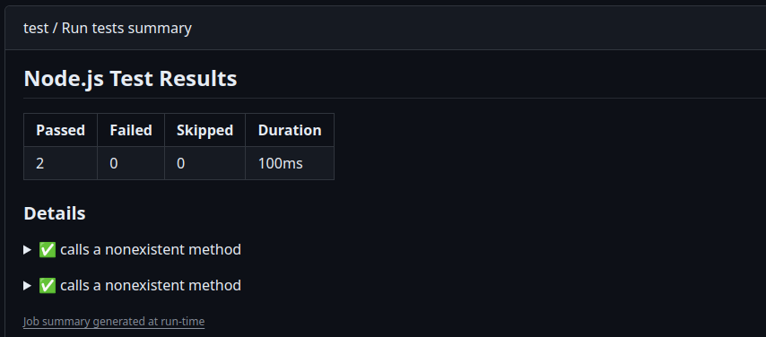
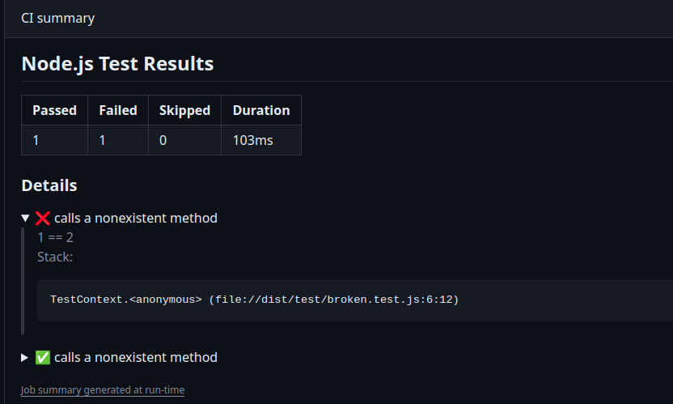

### Test 
To help to run our suit tests, and writing the workflow only once, we could use this one. 
It should be extensible, accepting parameters like `use_emulators` and specify which script should be run. 

If the test scenario is too different, we can always create a new one from the present configuration and specify it on our project.

The idea of this workflow is to show some ways of running our tests. And to have a default, but extensible, workflow to minimize some mistake that could happen. Some nice features to showcase here is the hability to generate reports inside the action, and to generate badges after the tests.

## Reports(Success)

## Report(Failure)
